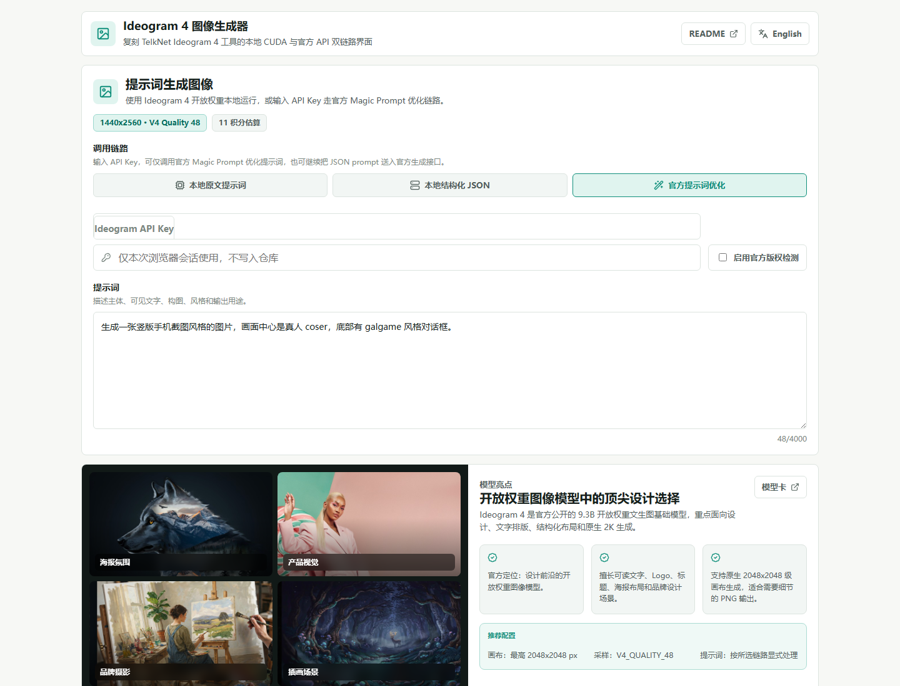
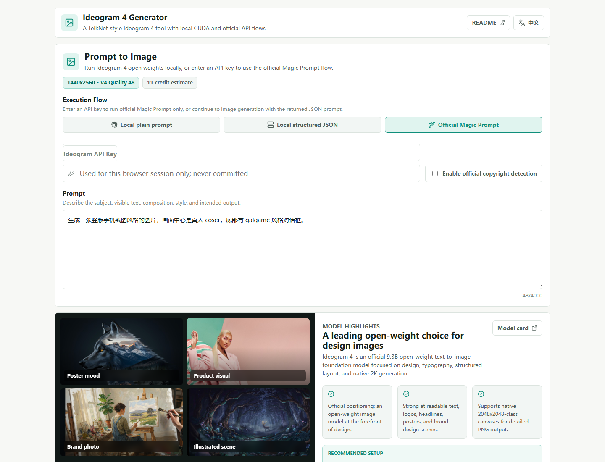

# Ideogram 4 图像生成器

<p align="center">
  中文 | <a href="./docs/README.en.md">English</a>
</p>

复刻 TelkNet 项目中 `Ideogram 4` 图像生成工具的开源独立版。它保留原工具的参数习惯：`prompt / width / height / sampler_preset / seed / candidate_count`，并提供两条明确链路：

- **本地 CUDA 开放权重链路**：默认模式，不接入官方 Magic Prompt；自然语言提示词按原文送入本地 Ideogram 4 运行时。
- **官方提示词优化链路**：输入 Ideogram API Key 后，只调用官方 `/v1/ideogram-v4/magic-prompt`；返回的 `json_prompt` 会继续交给本地 CUDA Ideogram 4 运行时出图。

> 在线体验：已接入官方提示词优化链路的 TelkNet Ideogram 4 页面在 [https://telknet.cc/tools/ideogram-v4](https://telknet.cc/tools/ideogram-v4)。本仓库是对应的开源本地版，启动后访问 `http://127.0.0.1:7860`。

## 截图

| Windows | Linux |
|---------|-------|
|  |  |

## 当前能力

- **复刻 TelkNet Ideogram 工具界面**：顶部工具卡、提示词输入、模型亮点、画布预设、采样预设、候选图数量和生成按钮保持同类结构。
- **中文默认 + 英文切换**：界面默认中文，可在右上角切换 English；README 同步提供中英两版。
- **Seed 控件**：前端提供 `SEED（可选）` 输入框和骰子按钮；`0` 表示运行时随机，点击骰子生成固定 seed。
- **本地开放权重模式**：通过官方 `ideogram-oss/ideogram4` 推理包调用 `ideogram-ai/ideogram-4-nf4` 或 `fp8` 权重。
- **官方 Magic Prompt 模式**：封装 API Key 与 Magic Prompt，请求只到官方提示词优化接口；生成图片时使用优化后的 JSON Prompt 本地渲染到 `runtime/outputs/`。
- **仅优化提示词**：官方模式下可只调用 Magic Prompt 获取 JSON Prompt，不触发本地出图；生成图片按钮会继续使用本地 CUDA。
- **严格参数校验**：所有生成模式尺寸范围 `256-2048`、步进 `16`、最大宽高比 `6:1`；Magic Prompt 需要支持的比例桶；候选图 `1-4`；seed 范围 `0-2147483647`。
- **不做静默降级**：缺少 API Key、缺少 HF_TOKEN、Magic Prompt 比例不支持、CUDA 不可用或权重未授权时都会显式失败。
- **GitHub Actions 发布**：支持 Windows / Linux GPU CUDA NF4 便携包，Release 产物包含 Ideogram 4 NF4 权重缓存，运行时不再触发模型下载。

## 调用链路说明

| 模式 | UI 名称 | 是否接入官方提示词优化 | 输入 | 输出 |
|------|---------|------------------------|------|------|
| `local_plain` | 本地原文提示词 | 否 | 自然语言 prompt | 本地 PNG |
| `local_json` | 本地结构化 JSON | 否 | Ideogram 4 JSON caption | 本地 PNG |
| `official_magic` | 官方提示词优化 | 是 | 自然语言 prompt + API Key | 本地 PNG（提示词由官方优化） |

所有生成模式都使用本地 `256-2048`、16 步进画布；官方链路只负责把自然语言 prompt 优化成 Ideogram 4 JSON Prompt，不负责生成图片。

官方模式包含两个动作：

- `仅优化提示词`：只调用 `/v1/ideogram-v4/magic-prompt`，返回结构化 JSON Prompt，不生成图片。
- `生成图像`：先调用 Magic Prompt，再把返回的 JSON Prompt 送入本地 CUDA 运行时。项目不会请求官方 `/v1/ideogram-v4/generate`；Magic Prompt 仍需要 Active API Key。

## 源码拉取与运行

### 1. 拉取源代码

```bash
git clone https://github.com/mason369/ideogram-4-generator.git
cd ideogram-4-generator
```

### 2. 创建虚拟环境并安装 Python 依赖

Windows：

```powershell
python -m venv venv310
venv310\Scripts\python -m pip install --upgrade pip setuptools wheel
venv310\Scripts\python -m pip install -r requirements.txt
```

Linux / WSL：

```bash
python3 -m venv venv310
source venv310/bin/activate
python -m pip install --upgrade pip setuptools wheel
python -m pip install -r requirements.txt
```

如果 Ubuntu / WSL 提示缺少 `venv` 模块，先安装：

```bash
sudo apt-get update
sudo apt-get install -y python3.10-venv
```

### 3. 安装前端依赖并构建界面

```bash
npm install
npm run build
```

### 4. 运行仅优化提示词模式（无需本地 GPU，可选）

Windows：

```powershell
venv310\Scripts\python run.py
```

Linux / WSL：

```bash
source venv310/bin/activate
python run.py
```

打开 `http://127.0.0.1:7860`，选择 **官方提示词优化**，点击 **仅优化提示词**。可以在界面输入 Ideogram API Key，也可以设置环境变量 `IDEOGRAM_API_KEY`。

> 这个动作只调用 Magic Prompt，不生成图片。只要点击 **生成图像**，就会进入本地 CUDA 出图流程，需要执行下一节的本地模型准备。

### 5. 源码方式运行本地 CUDA 生成模式

源码运行本地 CUDA 生成需要 CUDA 环境，并已在 Hugging Face 接受 `ideogram-ai/ideogram-4-nf4` 权重许可。该模型为 gated 仓库；匿名访问仅限模型卡等公开说明文件，权重和配置文件下载需要登录认证并完成许可授权。

Windows PowerShell：

```powershell
$env:HF_TOKEN="你的 Hugging Face Token"
venv310\Scripts\python install.py --no-run
venv310\Scripts\python tools\download_ideogram_weights.py --repo-id ideogram-ai/ideogram-4-nf4 --cache-dir models/hf-cache
venv310\Scripts\python run.py
```

Linux / WSL：

```bash
export HF_TOKEN="你的 Hugging Face Token"
source venv310/bin/activate
python install.py --no-run
python tools/download_ideogram_weights.py --repo-id ideogram-ai/ideogram-4-nf4 --cache-dir models/hf-cache
python run.py
```

> 注意：该步骤仅适用于源码运行。Release 便携包由 GitHub Actions 在发布阶段下载并内置模型缓存，运行时不再触发模型下载。

必需条件：

- 已在 Hugging Face 接受 `ideogram-ai/ideogram-4-nf4` 权重许可。
- 环境变量 `HF_TOKEN` 已设置。
- NVIDIA CUDA GPU；`nf4` 是 CUDA 路径。
- 系统内存建议至少 `24 GiB`；程序会用 `IDEOGRAM_MIN_SYSTEM_MEMORY_GB` 检查，低于阈值会显式失败，避免 WSL 被 OOM killer 直接杀掉。默认 WSL 约 `16 GiB` 内存不足，需要在 `.wslconfig` 中提高 `memory` 后重启 WSL。
- 显存建议 `24 GB+`，适用于较长 Magic Prompt JSON、9:16/高分辨率和 `V4_QUALITY_48`。`16 GB` 显存可用于低分辨率、短提示词和较快采样预设的探索性测试，不作为推荐配置。
- 已安装 `git+https://github.com/ideogram-oss/ideogram4.git`。

### 6. 开发测试命令

```bash
npm run typecheck
npm run build

python -m pip install -r requirements-dev.txt
pytest -q
python run.py --self-test
```

### 常用环境变量

| 变量 | 说明 |
|------|------|
| `IDEOGRAM_API_KEY` | 官方 API Key；UI 输入为空时读取 |
| `HF_TOKEN` | 下载 gated 权重 |
| `IDEOGRAM_QUANTIZATION` | `nf4` 或 `fp8`，默认 `nf4` |
| `IDEOGRAM_DEVICE` | 默认 `cuda` |
| `IDEOGRAM_HF_CACHE` | 指向已下载的 Hugging Face cache |
| `IDEOGRAM_MIN_SYSTEM_MEMORY_GB` | 本地生成前的系统内存下限，默认 `24` |
| `IDEOGRAM_OUTPUT_DIR` | 输出目录，默认 `runtime/outputs` |

## 参数参考

| 参数 | 默认值 | 范围 |
|------|--------|------|
| `width` | `2048` | `256-2048`，16 步进 |
| `height` | `2048` | `256-2048`，16 步进 |
| `sampler_preset` | `V4_QUALITY_48` | `V4_QUALITY_48` / `V4_DEFAULT_20` / `V4_TURBO_12` |
| `seed` | `0` | `0-2147483647`，`0` 表示随机 |
| `candidate_count` | `1` | `1-4` |

如果 seed 为 `0`，后端会生成一个随机 base seed；多候选图使用 `base_seed + index`。官方提示词优化模式同样使用这个本地 seed 规则，因为图片由本地 CUDA 生成，不会向官方出图接口发送 seed 或出图请求。

## 模型与公开排行

Ideogram 4 是 Ideogram 发布的首个开放权重文生图基础模型，官方描述为 **9.3B 参数**、面向设计、文字排版、结构化布局与原生 2K 生成。公开资料中，官方 README / 模型卡强调：

- 在 Design Arena 中是排名最靠前的开放权重设计向图像模型之一。
- 在 ContraLabs 文字排版评测中，Ideogram 4 在设计师偏好和可用于客户工作评分上领先多个强基线。
- 在 LMArena 图像榜单中，Ideogram 是排名靠前的开放权重图像实验室之一。
- 开放权重模型支持结构化 JSON prompt、bbox 布局、色彩调色板和可读文字生成。

参考链接：

- [Ideogram 4 GitHub](https://github.com/ideogram-oss/ideogram4)
- [Ideogram 4 NF4 Hugging Face Model Card](https://huggingface.co/ideogram-ai/ideogram-4-nf4)
- [Ideogram 4 技术博客](https://ideogram.ai/blog/ideogram-4.0/)
- [Magic Prompt v4 API](https://developer.ideogram.ai/api-reference/api-reference/magic-prompt-v4)

## 论文 / 引用

官方仓库给出的引用格式：

```bibtex
@misc{ideogram-4-2026,
  author={Ideogram AI},
  title={{Ideogram 4}},
  year={2026},
  howpublished={\url{https://ideogram.ai/blog/ideogram-4.0/}},
}
```

## 打包与发布

本仓库提供两个 workflow：

| Workflow | 用途 |
|----------|------|
| `.github/workflows/build.yml` | 在 Windows 与 Ubuntu 上安装依赖、构建前端、运行 pytest、自检服务 |
| `.github/workflows/release.yml` | 构建 Windows / Linux GPU CUDA NF4 便携包并上传 Release |

Release 打包规则：

- Windows：`Ideogram4Generator-Windows-GPU-CUDA-NF4-Portable.7z.001` / `.7z.002` ...
- Linux：`Ideogram4Generator-Linux-GPU-CUDA-NF4-Portable.tar.partaa` / `.tar.partab` ...
- Release 打包需要在 GitHub 仓库设置 secret `HF_TOKEN`，并确保该 token 已接受 `ideogram-ai/ideogram-4-nf4` 模型许可；该模型的权重和配置文件不能匿名下载。
- Release workflow 会在 Actions runner 中自动下载 `ideogram-ai/ideogram-4-nf4` 到 `models/hf-cache`，校验缓存非空，再用 PyInstaller 打包。
- `HF_TOKEN` 只作为 GitHub Actions secret 注入下载步骤，不会写入仓库、README、Release Notes 或打包产物；打包前会清理并扫描 Hugging Face cache 中的 token 文件和 token 内容。
- Release 产物包含前端静态资源、Python 服务、开放权重运行时依赖和 Hugging Face 权重缓存；解压运行时不再触发模型下载。
- workflow 会直接生成小于 GitHub Release 单文件上传限制的分卷和 `.sha256` 校验文件。Windows 下载全部 `.7z.00x` 后从 `.7z.001` 解压；Linux 下载全部 `.tar.part*` 后执行 `cat *.tar.part* > package.tar && tar -xf package.tar`。
- workflow 在 build job 内直接上传分卷到 GitHub Release，不通过 Actions artifact 中转。
- 如果 `HF_TOKEN` 缺失、模型许可未接受、CUDA 依赖未收集成功或模型缓存为空，workflow 会显式失败，不上传不完整 GPU 包。

## 开发命令

```bash
npm install
npm run typecheck
npm run build

python -m pip install -r requirements.txt -r requirements-dev.txt
pytest -q
python run.py --self-test
python run.py
```

## License

本仓库代码使用 MIT License。Ideogram 4 权重、开放权重运行时和模型许可请遵循 Ideogram / Hugging Face 页面中的对应条款。
